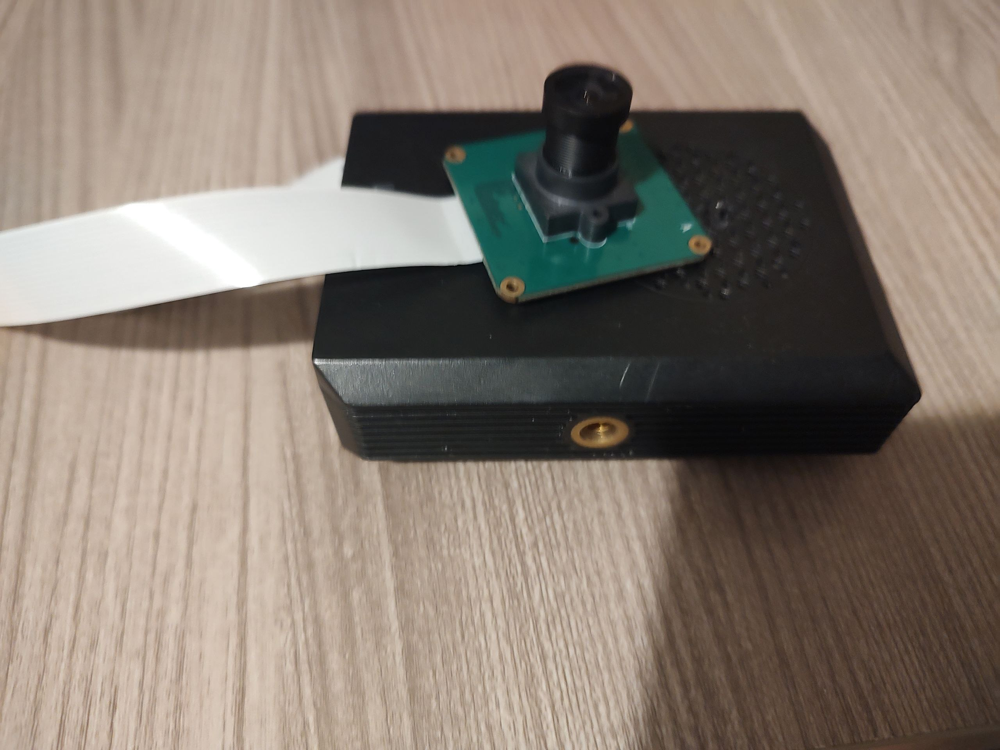

# AstroUnique - Night Sky Watcher

---

## Hardware Requirements



This software is specifically designed for **Raspberry PI 4 B** single-board computer and **Pi Camera**. Despite of this, it should be executable on any other single-board computer.

In case of using Raspberry PI and PI Camera, I recommend to purchase one with **Sony IMX290 Sensor** or other that can perform high-quality photos.

And of course buy a telescope for better photos!

---

## Installation

It's easier than you think, that's it, just clone this repo and type in your terminal or console this (in the project folder):

```bash
pip install -r requirements.txt
```

Before running, just generate the self-signed certificate. Type this:

```bash
openssl req -x509 -nodes -days 365 -newkey rsa:2048 -keyout local.key -out local.crt
```

You have to install **openssl package** for your distro.

---

## AstroUnique - What's it?

AstroUnique is basically a live stream of Raspberry PI Camera optimized for sky watching and with a lot of feature, like:

- Detection Mode: Identifies celestial bodies and compares them with SIMBAD database to assign your photos the specifical name of them

- Timelapse Mode: Captures all the night beautiful photos and then builds a video using FFMPEG

- Live Streaming: Views in real time what your telescope observes

They can look like a few things, but in a near future more feature will come out. 

For an example:

- [ ] Using APIs to move your telescope engines to follow celestial bodies position: in progess

- [ ] Web Database Catalog: a simple GUI to see the reports of your database catalog (Now it's simply a txt file with some information): in progess

---

## Running after installation

After installing dependencies, run the flask python server (in the project directory):

```bash
python main.py
```

It will run firstly the camera and then the flask environment.

---

# Credits

This project is based on a revisited version of [this open-source project](https://github.com/EbenKouao/pi-camera-stream-flask).

Thanks very much for inspiration

###### 

###### AstroUnique 0.0.1 ALPHA VERSION - GPL v3.0 LICENSED
